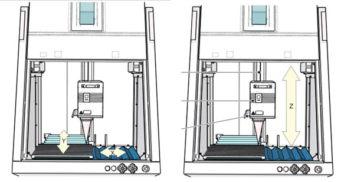
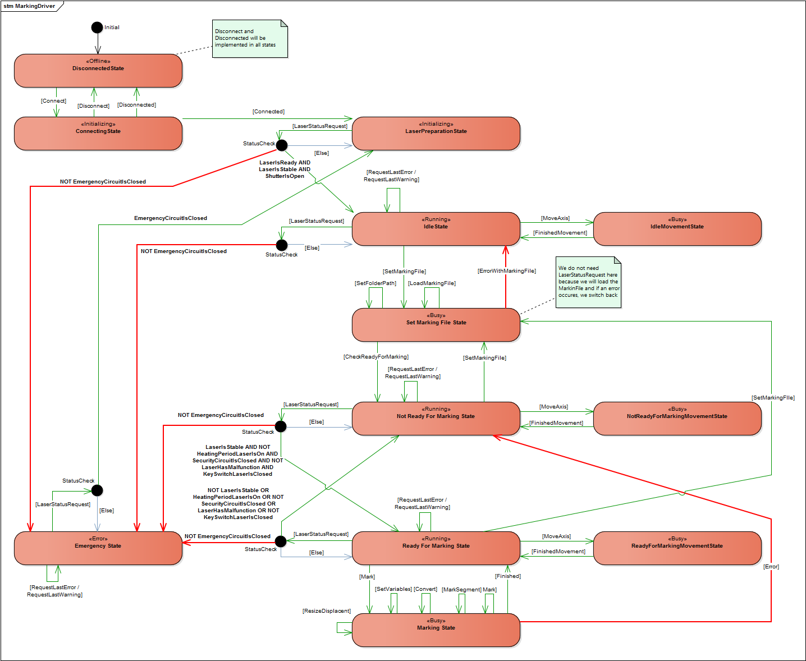

---
uid: TrumpfMarkingLaserDriver
---
# Trumpf Laser Driver

The communication to the laser hardware is only possible with the software TruTops Mark (futher only: _software_). A driver for the TruTopsMark software was required. The driver communicates with the software over TCP with TLV messages. Multiple messages are needed for the laser process (see TruTopsMarkProtocol)

The driver messages are designed to work with the version 2.9.2 of the software. The current versions can be found here: `M:\150_electronic_systems\03_Software\01_Laserbedruckung\Trumpf\`.

The driver implements the [IMarkingLaserDriver](xref:Moryx.Drivers.IMarkingLaserDriver) interface.

## Setting of marking file

Steps:

- Set folder path
- Load marking file
- Open laser shutter

To be done ...

## The Marking Process

To be done ...

## Movement of Axes

The TruTopsMarkDriver supports the movement of axes. The general API allows axis movements which were physically not executable. The following movements are supported by the TruTopsMarkDriver

## General Axes

The overload for moving axes to a defined value of double can move the general axes.

````cs
void MoveAxis(Axes axis, double targetPosition, ...);
````

The following axes can be moved to a target position of double value:



|Axis| Description |
|----|-----|
| A | Rotating axis. If two rotating axes are used the A axis is the axis which is inside the laser |
| D | Rotating axis. If two rotating axes are used the D axis is the axis which is outside the laser |
| T |  |
| S |  |
| X | Linear axis to move the workpiece in x direction |
| Y | Linear axis to move the workpiece in y direction |
| Z | Height of the laser head |

All other axis will lead to an exception by the driver because it is not supporting other axis or movement to a defined value.

## Special Axes {#axesMovement-Special}

The second overload for moving axes to a defined position can move axes to predefined values.
The definition of axes position values can be done in the configuration.
The configuration holds a mapping from the target axis and the target position enum with the value.
Some axes are predefined and can not be mapped.

````cs
void MoveAxis(Axes axis, AxisPosition targetPosition, ...);
````

Predefined axis position movements:

|Axis| Description |
|----|-----|
| [All](xref:Moryx.Drivers.Axes.All) | Only the position [Reference](xref:Moryx.Drivers.Axes.Reference) can be used to move all axis to the initial position |
| [C](xref:Moryx.Drivers.Axes.C), [RotationPlate](xref:Moryx.Drivers.Axes.RotationPlate) | Rotation plate. The plate can do the following actions: [Rotate](xref:Moryx.Drivers.AxisPosition.Rotate), [RotateClockWise](xref:Moryx.Drivers.AxisPosition.RotateClockWise), [RotateCounterClockwise](xref:Moryx.Drivers.AxisPosition.RotateCounterClockwise) |
| [Door](xref:Moryx.Drivers.Axes.Door) | The door can be [Open](xref:Moryx.Drivers.AxisPosition.Open) or [Close](xref:Moryx.Drivers.AxisPosition.Close) |

As described above, other position have to be set in the configuration. All other combinations will lead to an exception by the driver.

## State Machine



**DisconnectedState**
The driver will be in the disconnected state if no connection to the software is established or the connection was broken.

**ConnectingState**
To the connecting state will be switched if and only if the internal binary connection starts to connect to the software.
If the connection will be closed or cannot be established, the disconnected state will be set.

**LaserPreparationState**
If the internal binary connection was established successfully, the state machine will move to the LaserPreparationState.
The goal of this state is to achieve a prepared laser. A prepared laser must have the following properties:

Needed properties:

- ShutterIsOpen

This state opens the shutter of the laser while entering this state to achieve the ShutterIsOpen property.

If all the points are met, the next state will be the idle state.

**IdleState**
The driver moves to the _IdleState_ if the connection is established. The only possibility to get the current state of the laser is to poll the status of the software sequentially. So the _IdleState_ will start a timer for the status polling while entering the state. A status response contains a list of laser properties which describes the current laser status. For now it is only necessary to check the _EmergencyCircuitIsClosed_ parameter which must be true to go further with the state machine.

Now the API methods which can be called:

````cs
void SetMarkingFile(MarkingFile file, DriverResponse<MarkingFileResponse> callback);
void MoveAxis(Axes axis, double targetPosition, DriverResponse<AxisMovementResponse> callback);
void MoveAxis(Axes axis, AxisPosition targetPosition, DriverResponse<AxisMovementResponse> callback);
void RequestLastError();
void RequestLastWarning();
````

It is possible to open, close or rotate the door from a laser workstation in this state with the _MoveAxis_ method which switches the state to the _IdleMovementState_.
It is also possible to move any axis at the Laser with the _MoveAxis_ method like to move the WPC in X or Y direction or rotate it.
A request can also be started to get the last error or warning from the laser which can be used for example for a user notification.

The _SetMarkingFile_ method will switch the state machine to the _SetMarkingFileState_ to handle the marking file.
When the status polling fails or the emergency circuit is not closed, the state will be switched to the _EmergencyState_:

**IdleMovementState**
The _IdleMovementState_ ist a state for movement processes at the laser in the _IdleState_ to avoid other request messages which cannot be processed by the laser. This state is declared as a busy state to inform a resource. If any movement at the laser are finished the state machine switches back to the _IdleState_.

**SetMarkingFileState**
When the marking file was set within the _RunningState_ the statemachine switches to this state. On enter of the state, the folder path will be setted which is given in the [MarkingFile](@ref Moryx.Drivers.MarkingFile). The laser have to load the marking file. If the laser have any problems with the given operations, the state will be switched back to _RunningState_.

It is not possible to send other messages during this state because the laser is busy and can´t handle other requests. So the status polling will be also stopped in this state.
After finish these operations successfully, the state machine switches to _NotReadyForMarkingState_

**NotReadyForMarkingState**
This state ensures that the driver waits until the laser is ready before any mark requests are possible.
The status polling will be used to check if the parameters met the following conditions:

- The laser **is** stable
- and heating time **turned off**
- and the security circuit **is** closed
- and the laser has **not** an error
- and the key lock for laser lock **is** closed

If all conditions are met, the state machine switches to _ReadyForMarkingState_.

API methods which can be called:

````cs
void SetMarkingFile(MarkingFile file, DriverResponse<MarkingFileResponse> callback);
void MoveAxis(Axes axis, double targetPosition, DriverResponse<AxisMovementResponse> callback)
void MoveAxis(Axes axis, AxisPosition targetPosition, DriverResponse<AxisMovementResponse> callback)
void RequestLastError();
void RequestLastWarning();
````

It is possible to move any axis at the laser with the _MoveAxis_ method for example to rotate the door.
At any movement requests the state machine switches to the _NotReadyForMarkingMovementState_ to avoid other requests to the laser.

In State it is also possible to trigger a request to get the last error or warning.
The marking file can be set again during the waiting until the laser is ready.

**NotReadyForMarkingMovementState**
This state is like the _IdleState_ which indicates a busy state of the laser and avoids other requests to the laser.

**ReadyForMarkingState**
Within this state, the marking can be called.
Available methods of the API:

````cs
void Mark(int segment, Dictionary<string, string> variables, DriverResponse<MarkingResponse> callback);
void MoveAxis(Axes axis, double targetPosition, DriverResponse<AxisMovementResponse> callback);
void MoveAxis(Axes axis, AxisPosition targetPosition, DriverResponse<AxisMovementResponse> callback);
void RequestLastError();
void RequestLastWarning();
````

With the _Mark_ method, the marking will be triggered and the state switches to the _MarkingState_ with the given segment and variables. In this state it is also possible move any axis at the laser or trigger a request to get the last error or warning.
For any movement the state machine switches to the _ReadyForMarkingMovementState_ and back if the movement is finished.

After finish of the marking process, the state switches back to the _ReadyForMarkingState_ to start marking on the same file, again.
Also the status polling is active in this state. If the polling fails or one of the following properties don't met, the state will be switched to the _NotReadyForMarkingState_:

- Laser is **not** stable
- or Heating timer is on
- or security circuit is **not** closed
- or the laser has an error
- or the key lock for laser lock is **not** closed

If the emergency circuit is not closed, the state machine switches to the _EmergencyState_.

**ReadyForMarkingMovementState**
This state is like the _IdleState_ or the _NotReadyForMarkingMovementState_ which indicates a busy state of the laser and avoids other requests to the laser.

**MarkingState**
As shown in the state machine, the loaded marking file will be resized, rotated or moved (if the parameters are given) before the variables are set and the marking process will be started with the given segment.
If the marking process was successful the state machine switches back to the _ReadyForMarkingState_ to have
the possibility to start the marking process with a different segment or variables. If the marking process was faulty the state machine switches back to the _NotReadyForMarkingState_ because the laser is may be not ready.

**EmergencyStateState**
This state will be used if the emergency circuit is not closed and to indicate an error which have to be fixed at the hardware. So everything will be stopped and no other requests to the laser are possible. When entering the state the last error and the last warning will be fetched to use them in debug. The error state can only be leaved if the emergency circuit is closed.

The state machine switches to the _RunningState_ back where the laser process must be start at the beginning.

## Debugging and Simulation

For debugging and simulation of the implemented driver, the TruTopsMark software can be installed on the developers computer. Install the current version from the software folder (described on the top of this page). Start the software.

The software starts with the _VGSimulator_ where multiple parameters and variables can be set.
In the main window you have to change the communication to TCP: _Module -> TCP/IP_. After the change the interface is listening on port 50000 per default. On the bottom right corner of the main window, the interface can be resetted after the connection was lost or an error occurs.